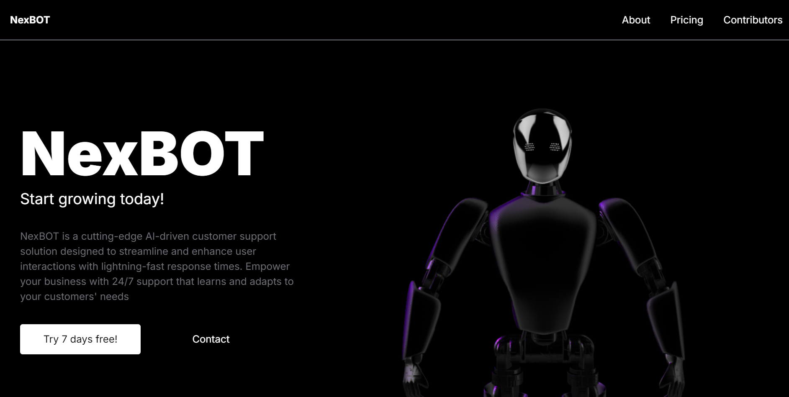
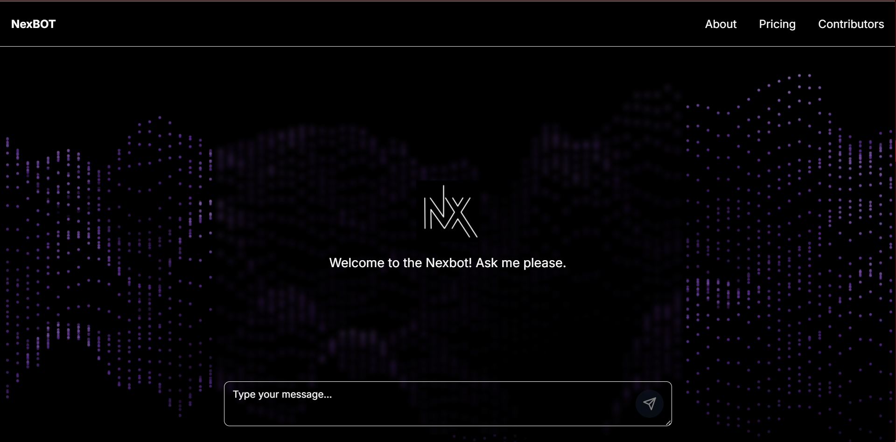

   
    <a href="https://youtube.com/playlist?list=PLJT1e2CqMCFCdBm_B1zyMfFh7Mu_E3xme&si=zHGmFLwoV8rY81vG" target="_blank">
        
      
    </a>
   

  

    
    
    
    
    

  

  <h3 align="center">NexBOT Customer support AI </h3>

